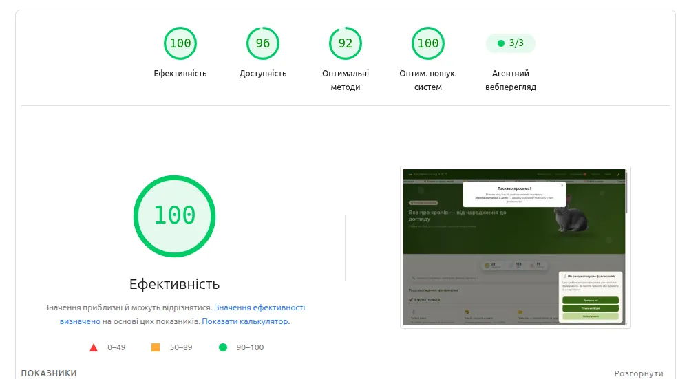
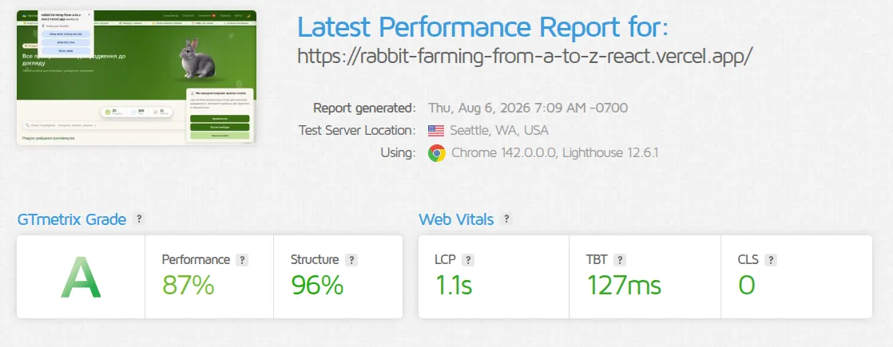
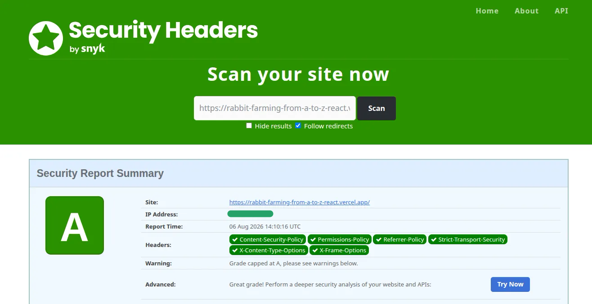
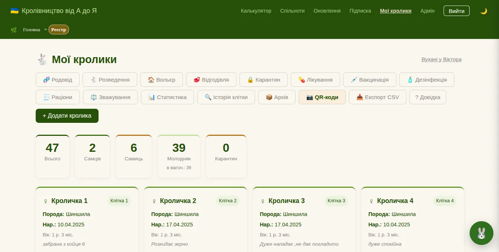
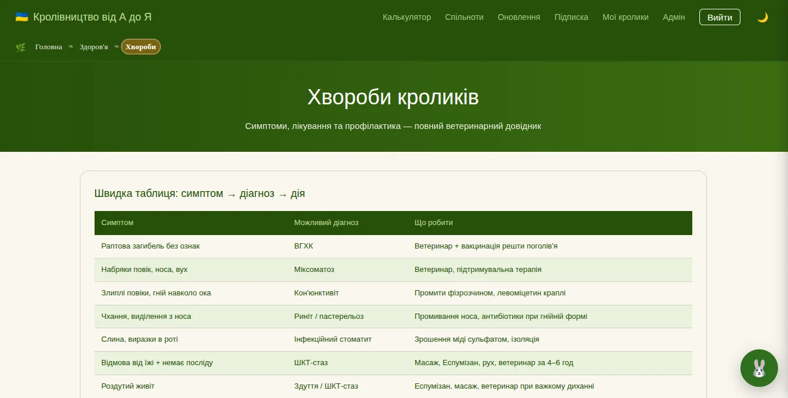
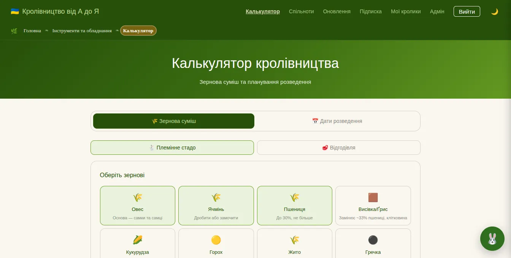
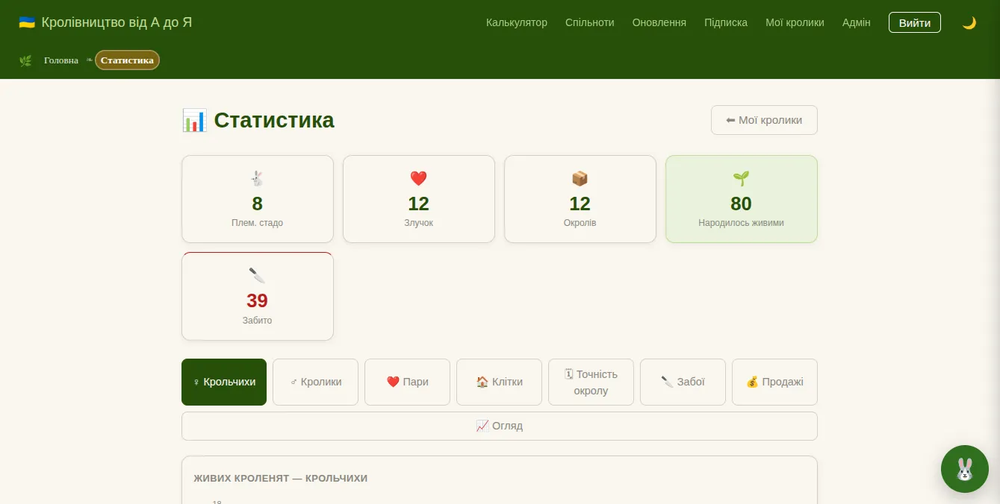
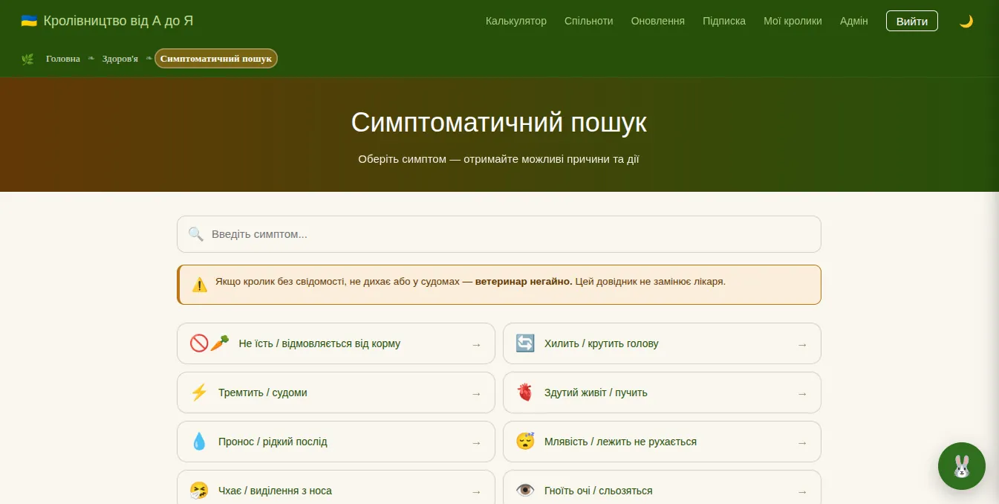

# 🐰 Кролівництво від А до Я

<p align="center">
  
</p>

Сучасний **PWA-застосунок** для кролівників, який поєднує великий тематичний довідник, систему обліку господарства та практичні інструменти для щоденної роботи.

Проєкт розроблений на **React 19 + TypeScript + Vite + Supabase** з акцентом на продуктивність, SEO, офлайн-режим і модульну архітектуру.

---

# Live Demo

**Відкрити застосунок**

https://rabbit-farming-from-a-to-z-react.vercel.app/

---

# Основні можливості

- Великий довідник із кролівництва
- Понад 200 тематичних сторінок
- Симптоматичний пошук
- Довідник хвороб
- Практичні рекомендації
- Реєстр кролів
- Облік злучок
- Облік окролів
- Статистика господарства
- QR-паспорти кролів
- Калькулятори
- PWA (офлайн-режим)
- Адаптивний дизайн
- SEO-оптимізація
- Швидка навігація

---

## Lighthouse



**Оцінка продуктивності:**

| Метрика        | Значення |
| -------------- | -------: |
| Performance    |      100 |
| Accessibility  |       96 |
| Best Practices |       92 |
| SEO            |      100 |

---

## 🚀 GTmetrix

Результати останнього аналізу продуктивності.

<p align="center">
  
</p>

- Grade: **A**
- Performance: **87%**
- Structure: **96%**
- LCP: **1.1 s**
- TBT: **127 ms**
- CLS: **0**

---

## 🔒 Security Report

Перевірка HTTP-заголовків безпеки.

<p align="center">
  
</p>

- Rating: **A**
- Content-Security-Policy
- Strict-Transport-Security
- X-Frame-Options
- X-Content-Type-Options
- Referrer-Policy
- Permissions-Policy

---

# Статистика проєкту

| Показник               | Значення |
| ---------------------- | -------: |
| React Router маршрутів |      176 |
| Сторінок (`src/pages`) |     200+ |
| React-компонентів      |       27 |
| Data-модулів           |       25 |
| Unit-тестів            |       38 |
| Test Suites            |        7 |
| E2E сценаріїв          |        2 |
| TypeScript             |      Так |
| PWA                    |      Так |
| SEO                    |      Так |
| Supabase               |      Так |

---

# Скріншоти

| Головна                    | Реєстр                         |
| -------------------------- | ------------------------------ |
|  |  |

| Хвороби                        | Калькулятор                      |
| ------------------------------ | -------------------------------- |
|  |  |

| Статистика                       | Симптоми                       |
| -------------------------------- | ------------------------------ |
|  |  |

---

# Технології

## Frontend

- React 19
- TypeScript 5
- React Router 7
- Vite 7

## Backend

- Supabase
- PostgreSQL
- Authentication
- Realtime

## Оптимізація

- PWA
- Service Worker
- Code Splitting
- React.lazy()
- Lazy Loading
- SEO
- JSON-LD
- Sitemap
- robots.txt
- llms.txt
- Prerender

---

# Архітектура

```
src/

├── assets/
├── components/
├── contexts/
├── data/
├── hooks/
├── layouts/
├── lib/
├── pages/
├── routes/
│   └── groups/
├── seo/
├── services/
├── styles/
├── test/
├── types/
├── utils/
└── main.tsx
```

---

# Якість проєкту

Проєкт проходить автоматичні перевірки:

- ESLint
- TypeScript
- Unit Tests
- Coverage
- Playwright E2E
- Production Build
- GitHub Actions CI

---

# Покриття тестами

| Метрика    | Покриття |
| ---------- | -------: |
| Statements |   87.83% |
| Branches   |   85.00% |
| Functions  |   79.54% |
| Lines      |   88.97% |

---

# Безпека

Реалізовано:

- Content Security Policy
- X-Frame-Options
- X-Content-Type-Options
- Referrer Policy
- Permissions Policy
- Cookie Consent
- Захищене підключення до Supabase
- HTTPS

---

# Встановлення

Клонувати репозиторій

```bash
git clone https://github.com/ViktorPro1/Rabbit-farming-from-A-to-Z-React-.git
```

Перейти до папки

```bash
cd Rabbit-farming-from-A-to-Z-React-
```

Встановити залежності

```bash
npm install
```

Запустити

```bash
npm run dev
```

---

# Production Build

```bash
npm run build
```

---

# Документація

```
docs/
```

Основні документи:

- Developer Guide
- Тестування
- Ліцензія (UA)
- License (EN)

---

# Деплой

Проєкт автоматично розгортається через **Vercel**.

Використовується:

- CDN
- HTTPS
- SPA Rewrite
- Автоматичний Production Build

---

# Roadmap

## Версія 1.0

- Великий довідник
- PWA
- Реєстр господарства
- Статистика
- SEO
- Supabase
- Автоматичне тестування

---

# Автор

**Viktor Pro1**

Проєкт створений вручну у **Visual Studio Code**.

Під час розробки використовувалися AI-інструменти як допоміжний засіб для аналізу, перевірки архітектури, оптимізації та документування. Усі ключові технічні рішення, реалізація функціональності та інтеграція компонентів виконані автором.

---

# Ліцензія

MIT License

Додатково:

- LICENSE
- LICENSE.uk.md
